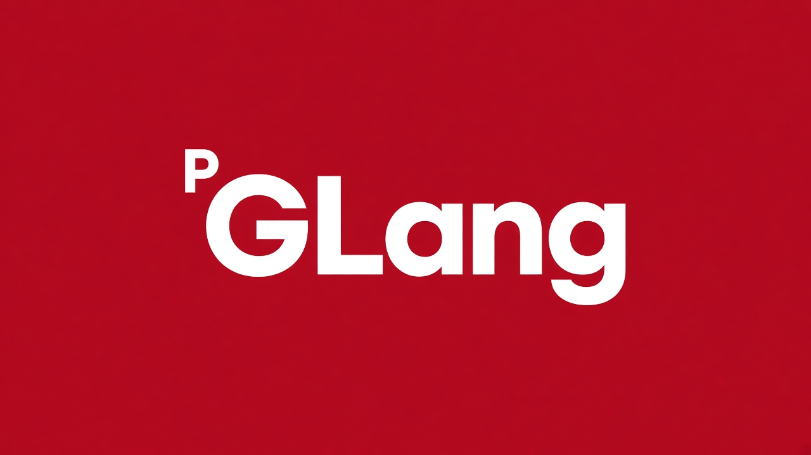

<p align="center">
  
</p>

<p align="center">
  <a href="#what-it-is">What it is</a>
  ·
  <a href="#what-it-is-not">What it is not</a>
  ·
  <a href="#cins-tur-and-kume">cins / tur / kume</a>
  ·
  <a href="#beside-pmusic">pmusic</a>
  ·
  <a href="#the-genlang-book">Book</a>
  ·
  <a href="#build">Build</a>
  ·
  <a href="#cli">CLI</a>
  ·
  <a href="#c-library">C library</a>
  ·
  <a href="#examples">Examples</a>
</p>

<p align="center">
  <a href="LICENSE"></a>
  <a href="include/genlang.h"></a>
  <a href="CHANGELOG.md"></a>
</p>

Current release: **0.1.0** · License: **MIT**

Learn the language in [The GenLang Book](docs/book/genlang-book.md). Jump to [build](#build) if you already know what it is.

---

# What it is

GenLang is a **declarative data language** and an **embeddable C library**. A `.gl` file is not a program. It declares:

- a **taxonomy** — what something *is* (`cins` / `tur`)
- **sets** — what group it *belongs to* (`kume` / `uye`)
- **named values** — records, lists, references (`veri`, `@name`)

Those three stay separate on purpose. JSON can store `boncuk` as an object. It cannot natively say that `Kedi` is a species of `Memeli`, that `boncuk` is a `Kedi`, *and* that `boncuk` also belongs to `EvcilHayvanlar` — without mixing those relations into one blob.

**The library is the product.** The CLI only consumes `include/genlang.h`.

```text
libgenlang  =  core product     (opaque C ABI)
genlang     =  CLI frontend     (include/genlang.h only)
```

Keep GenLang next to an application when the app needs a catalog with a real type tree *and* independent tags in the same document.

# What it is not

- Not a JSON or YAML replacement. Interchange exists; the point is taxonomy + sets.
- Not a programming language. No functions, loops, or evaluation beyond data and paths.
- Not SQL, an ORM, or a database.
- Not a template, markup, or config DSL that runs code, hits the network, or opens a shell.
- Not a place to infer types from tags, or tags from types.

# cins, tur, and kume

This distinction is the whole language.

| Keyword | English | Role |
| --- | --- | --- |
| `cins` | genus | A general type. The broad answer to “what *kind* is this?” |
| `tur` | species | A more specific type on the **same** graph. `Kedi` under `Memeli`. |
| `kume` | set | An unordered collection. Playlists, channels, tags — **not** types. |
| `veri` | data | A named value, optionally ` : Type`. |
| `uye` | member of | Puts an entity in a set. Being a `Kedi` never does this for you. |

```text
Type hierarchy (SUBTYPE_OF / TYPE_OF)     Set membership (MEMBER_OF)

  Kedi → Memeli → Hayvan → Canli            boncuk ∈ EvcilHayvanlar
  boncuk : Kedi                             boncuk ∈ SiyahHayvanlar
```

`cins` and `tur` are how you *write* general vs specific. They share one type graph: a `tur` may have children, a parent may be either kind. What the analyzer never does is treat a set as a type. `EvcilHayvanlar` is not a parent of `Kedi`. `uye boncuk -> EvcilHayvanlar` does not make `boncuk` a new species.

```gl
cins Canli
cins Hayvan -> Canli
cins Memeli -> Hayvan

tur Kedi -> Memeli
tur Kopek -> Memeli

kume EvcilHayvanlar
kume SiyahHayvanlar

veri boncuk : Kedi {
    isim = "Boncuk"
    yas = 4
    renk = "siyah"
}

uye boncuk -> EvcilHayvanlar
uye boncuk -> SiyahHayvanlar
```

Values: `null`, booleans, integers, floats, UTF-8 strings, lists, objects, references (`@name`). Identifiers are UTF-8 (`Canlı` is valid). Keywords stay ASCII. Nested path: `x.a[1].b[2]`. Import: `iceaktar "types.gl"` (local `.gl` only).

Commented walk-throughs: [`examples/cookbook.gl`](examples/cookbook.gl), [`examples/team.gl`](examples/team.gl), [`examples/values.gl`](examples/values.gl). Full rules: [The GenLang Book](docs/book/genlang-book.md).

# Beside pmusic

[pmusic](https://github.com/Padrosum/pmusic) is a keyboard-first terminal music player. GenLang is the catalog format meant to sit **next to it**, not inside the audio pipeline.

- **Types** = what a row *is*: album, track, artist (`examples/music.gl`).
- **Sets** = playlists and tags (`Gece`, `Favoriler`). A track is not on a playlist until `uye` says so.
- The host app parses with `libgenlang`, then queries (`gen_get`, `gen_set_members`, `gen_entities_of`). Playback stays in pmusic.

The same pattern applies to other Padrosum tools listed in [`examples/packages.gl`](examples/packages.gl): **pnot** (note kinds vs `Sifreli` / `Taslak` tags), **ppd**, **pixora**. GenLang holds metadata and taxonomy. Secrets and bytes stay out of the `.gl` file.

```bash
./build/genlang query examples/music.gl parca_01.sure_sn
./build/genlang repl examples/music.gl
# uyeler Gece
# liste Parca
```

# The GenLang Book

Canonical learning and usage text:

| Format | In this repo | On GitHub |
| --- | --- | --- |
| Markdown | [`docs/book/genlang-book.md`](docs/book/genlang-book.md) | [view](https://github.com/Padrosum/GenLANG/blob/main/docs/book/genlang-book.md) |
| PDF | [`docs/book/genlang-book.pdf`](docs/book/genlang-book.pdf) | [view](https://github.com/Padrosum/GenLANG/blob/main/docs/book/genlang-book.pdf) · [raw download](https://github.com/Padrosum/GenLANG/raw/main/docs/book/genlang-book.pdf) |

Short bilingual tutorial: [`docs/usage.md`](docs/usage.md).

---

# Build

Requires CMake 3.16+, a C17 compiler, and a standard C library. `uthash` is vendored.

```bash
git clone git@github.com:Padrosum/GenLANG.git
cd GenLANG
cmake -S . -B build
cmake --build build
ctest --test-dir build
```

```bash
cmake --install build
```

```cmake
find_package(GenLang REQUIRED)
target_link_libraries(my_app PRIVATE GenLang::genlang)
```

```bash
pkg-config --cflags --libs genlang
```

# CLI

```bash
genlang examples/animals.gl
genlang check file.gl
genlang query file.gl boncuk.yas
genlang convert file.gl --json
genlang convert file.json --from-json
genlang convert file.gl --yaml
genlang convert file.yaml --from-yaml
genlang convert file.gl --binary
genlang convert file.bin --from-binary
genlang format file.gl
genlang format --in-place file.gl
genlang repl [file.gl]
```

Exit codes: `0` success, `1` general, `2` lex/parse, `3` semantic, `4` I/O.

REPL (library-backed): `dyaz`, `goster`, `uyeler`, `icerir`, `ustler`, `altlar`, `yol`, `ara`, `liste`, `yardim`, `temizle`, `cikis`. `liste Kedi` lists entities of that type (including subtypes).

# C library

```c
#include <genlang.h>
#include <stdio.h>

int main(void)
{
    GenContext *ctx = gen_context_create();
    GenDocument *doc = NULL;
    GenValue *value = NULL;

    if (gen_document_load_file(ctx, "examples/animals.gl", &doc) != GEN_OK) {
        fprintf(stderr, "%s\n", gen_error_message(gen_context_last_error(ctx)));
        gen_context_free(ctx);
        return 1;
    }

    if (gen_get(doc, "boncuk.yas", &value) == GEN_OK) {
        printf("yas = %lld\n", (long long)gen_value_int(value));
        gen_value_free(value);
    }

    gen_document_free(doc);
    gen_context_free(ctx);
    return 0;
}
```

- **OWNED** — context, document, `gen_get` values, query results, serialized text. Free with `gen_*_free` / `gen_string_free`.
- **BORROWED** — names and `const GenValue *` taken from a document. Valid until that document is freed.

No global context. Distinct `GenContext` objects may be used from different threads. Concurrent mutation of the same `GenDocument` is not supported.

Full API: [`docs/api.md`](docs/api.md). Book chapters 11–13 cover embedding.

# Other languages

Wrappers under [`bindings/`](bindings/) talk only to `include/genlang.h` + `libgenlang`:

| Language | Path | Approach |
| --- | --- | --- |
| C / C++ | `include/genlang.h` | public ABI |
| Python | `bindings/python` | `cffi` |
| Rust | `bindings/rust` | `Drop` wrappers |
| Go | `bindings/go` | `cgo` |
| Node.js | `bindings/node` | N-API |
| Java | `bindings/java` | JNA |
| C# | `bindings/csharp` | P/Invoke |

```bash
PYTHONPATH=bindings/python/src GENLANG_LIB_DIR=build python3 -c "import genlang; print(genlang.version())"
```

Details: [`docs/embedding.md`](docs/embedding.md).

# Architecture

```text
Source → Lexer → Parser → AST → Semantic analyzer → GenDocument
                                              /    |    \
                                      Type graph  Sets  Values
                                              \    |    /
                                                Query → Serialization
```

The CLI never implements parser or runtime logic. [`docs/architecture.md`](docs/architecture.md)

```text
include/genlang.h     public ABI
src/                  library
cli/                  genlang executable
bindings/             Python, Rust, Go, Node, C#, Java
lsp/                  language server
tests/                CTest
examples/             .gl samples
docs/                 book, grammar, API, embedding
docs/book/            The GenLang Book (Markdown + PDF)
docs/brand/           wordmark
cmake/                CMake / pkg-config
third_party/uthash/   vendored (not public API)
```

# Testing

```bash
ctest --test-dir build
```

The suite covers the lexer, parser, semantic analyzer, runtime, queries, serialization, the public C API, `examples/*.gl`, and language bindings when those tools are on `PATH`.

Rebuild the book PDF (optional; `pandoc` + WeasyPrint):

```bash
bash docs/book/build-pdf.sh
```

# Roadmap

The 0.1.0 line is a usable MVP. Later work stays behind the same C ABI.

| Series | Status |
| --- | --- |
| 0.1 Foundation | library, CLI, CTest |
| 0.2 Tooling | query, format, JSON, multi-error |
| 0.3 Growth | `iceaktar`, schemas, Unicode, Python / Rust / Go |
| 0.4 Editor & interop | LSP, YAML, binary, Node, C#, Java |
| 1.0 | WASM, ABI policy, concurrent read-only |

**Out of scope:** code, network, or shell in `.gl` files; inferring types from sets (or the reverse); replacing JSON as a general format.

# Documentation

- **Book (Markdown):** [`docs/book/genlang-book.md`](docs/book/genlang-book.md) · [GitHub](https://github.com/Padrosum/GenLANG/blob/main/docs/book/genlang-book.md)
- **Book (PDF):** [`docs/book/genlang-book.pdf`](docs/book/genlang-book.pdf) · [GitHub](https://github.com/Padrosum/GenLANG/blob/main/docs/book/genlang-book.pdf) · [download](https://github.com/Padrosum/GenLANG/raw/main/docs/book/genlang-book.pdf)
- [Short usage guide (Türkçe / English)](docs/usage.md)
- [Grammar](docs/grammar.md)
- [C API](docs/api.md)
- [Architecture](docs/architecture.md)
- [Embedding](docs/embedding.md)
- [AI usage guide](docs/ai-guide.md)
- [Changelog](CHANGELOG.md)
- [Contributing](CONTRIBUTING.md)

# License

[MIT](LICENSE). Copyright © 2026 Alihan Karakuş.

`uthash` is vendored under its own BSD-style license in [`third_party/uthash/`](third_party/uthash/).

# Examples

Runnable copies live under [`examples/`](examples/). More in [the book](docs/book/genlang-book.md).

### Types, sets, and membership

[`examples/animals.gl`](examples/animals.gl)

```gl
cins Canli
cins Hayvan -> Canli
cins Memeli -> Hayvan

tur Kedi -> Memeli
tur Kopek -> Memeli

kume EvcilHayvanlar
kume SiyahHayvanlar

veri boncuk : Kedi {
    isim = "Boncuk"
    yas = 4
    renk = "siyah"
}

veri karamel : Kopek {
    isim = "Karamel"
    yas = 7
    renk = "kahverengi"
}

uye boncuk -> EvcilHayvanlar
uye boncuk -> SiyahHayvanlar
uye karamel -> EvcilHayvanlar
```

```bash
./build/genlang query examples/animals.gl boncuk.yas
# 4
```

### Nested paths

[`examples/nested.gl`](examples/nested.gl) — `x.a[1].b[2]` is `60`.

```gl
veri x {
    a = [
        { b = [10, 20, 30] },
        { b = [40, 50, 60] }
    ]
}
```

### Optional schemas

[`examples/schema.gl`](examples/schema.gl) — extra keys on the instance are allowed; kinds must match.

```gl
cins Kayit {
    id = ""
}

cins Hayvan -> Kayit {
    isim = ""
    yas = 0
}

tur Kedi -> Hayvan {
    renk = ""
}

veri boncuk : Kedi {
    id = "kedi-001"
    isim = "Boncuk"
    yas = 4
    renk = "siyah"
    ekstra = true
}
```

### References

[`examples/relations.gl`](examples/relations.gl) — `@ahmet` is a reference, not a string and not a copy. A schema `@Kisi` requires the target to be that type (or a subtype).

```gl
cins Kisi

cins Proje {
    sahibi = @Kisi
    etiketler = [""]
}

veri ahmet : Kisi {
    isim = "Ahmet"
}

veri owner = @ahmet

veri proje : Proje {
    sahibi = @ahmet
    etiketler = ["genlang", "veri"]
}
```

### Guided walk-throughs

Comment-heavy samples that name each construct:

| File | What it teaches |
| --- | --- |
| [`examples/cookbook.gl`](examples/cookbook.gl) | `cins` / `tur` / `kume` / `veri` / `uye` — dish *kind* vs diet/season *tags* |
| [`examples/team.gl`](examples/team.gl) | Role vs team; `@Kisi` typed refs; `liste Kisi` lists all people |
| [`examples/values.gl`](examples/values.gl) | Every value kind, keyword object keys, entity named `liste` |

```bash
./build/genlang query examples/cookbook.gl mercimek.sure_dk
./build/genlang query examples/team.gl hata_42.sorumlu
./build/genlang query examples/values.gl tree.a[1].b[2]
```

### Imports

[`examples/import/`](examples/import/) — load the file; in-memory `parse` rejects `iceaktar`.

```gl
iceaktar "types.gl"

tur Kedi -> Memeli

veri boncuk : Kedi {
    isim = "Boncuk"
}
```
